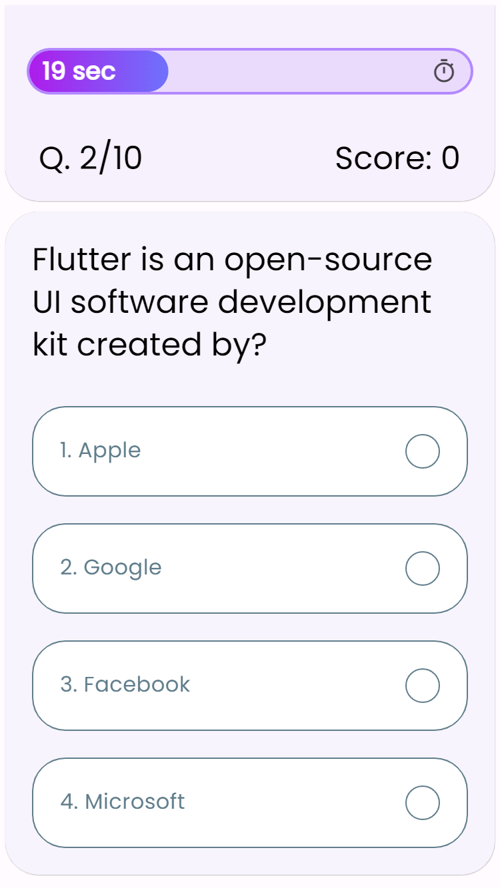
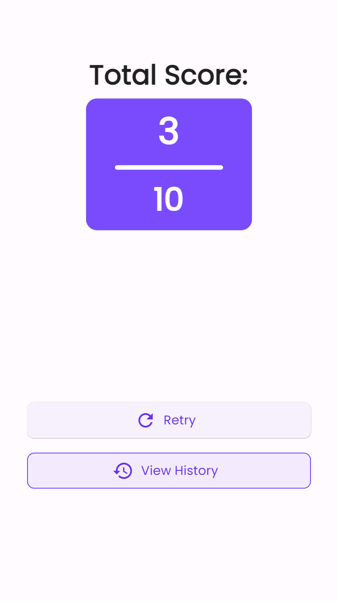
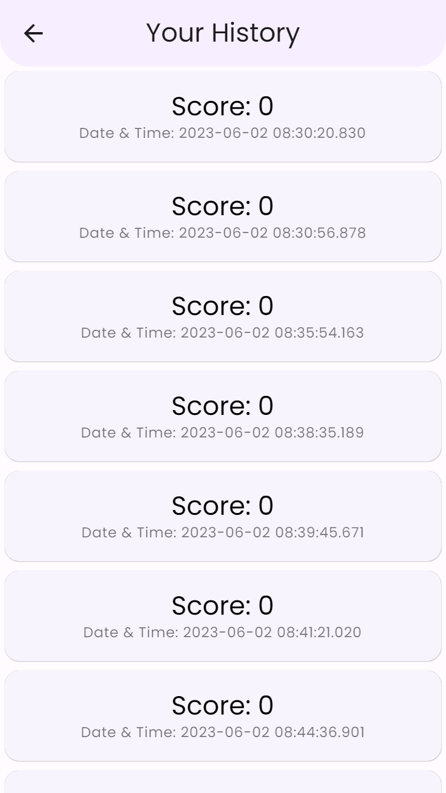

# Quiz App
Language : Dart
Framework : Flutter
IDE : Android Studio & VS Code

## Pages:
- [Welcome Page](lib/views/welcome/view.dart)
- [Quiz Page](lib/views/quiz/view.dart)
- [Score Page](lib/views/score/view.dart)
- [History Page](lib/views/history/view.dart)

## Screenshots:

### Welcome Page

### Quiz Page

### Score Page

### History Page

